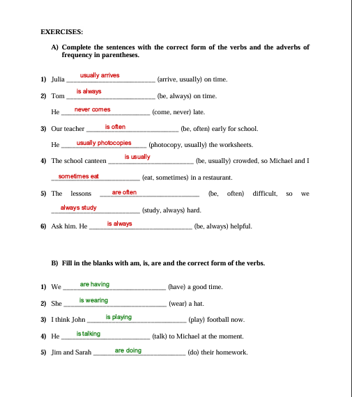

# Week 01 - Vocational English

## Topics

- Basic Structures
- Simple Present Tense
- Present Continuous Tense

---

[← Ana Sayfa](../../README.md) | [Next →](../../Week-02/Vocational-English/README.md)

## Exercises

